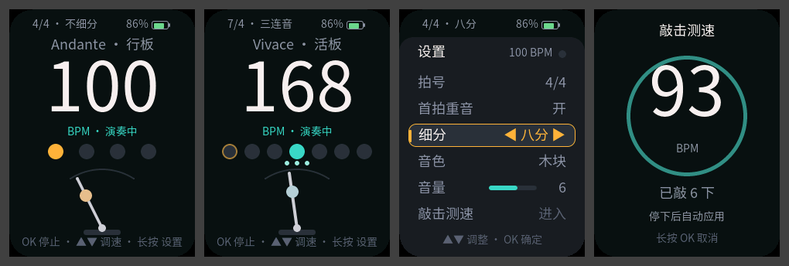

<p align="right">
  <a href="README.zh_CN.md">简体中文</a> · <strong>English</strong>
</p>

# Instrument Metronome — FoloToy AI Passport

An offline instrument metronome for the FoloToy AI Passport, with a fully Simplified Chinese
interface that runs entirely on three buttons. Clicks are placed with audio-sample accuracy and
never drift during long practice sessions, and the beat dots and pendulum on screen light up at
the moment each click actually leaves the speaker, so what you see always matches what you hear.

<p align="center">
  
</p>

> The preview is rendered on a computer by `tools/render_metronome_preview.py` with the real UI
> code; it is not a photo of the device.

## Quick start

1. Flash `build/FoloToy-AI-Passport-full.bin` to the device (see [Flash the firmware](#flash-the-firmware)); it boots straight into the metronome.
2. Press **UP / DOWN** to change the tempo, or hold to change it quickly; press **OK** to start (after a 3-second count-in) or stop.
3. **Long-press OK** to open settings for meter, subdivision, sound, and volume; **double-press OK** to tap a tempo along with music.

## Features

| Feature | Details |
| --- | --- |
| Tempo | 30–250 BPM; each press changes ±1, holding accelerates (single steps first, then jumps to multiples of 5 after about 2 s) and stops on release |
| Meter and accent | 1–12 beats per bar; the downbeat accent can be turned on or off and its beat dot is amber |
| Subdivision | None / eighths / triplets / sixteenths; subdivision clicks are softer than beats |
| Count-in | Pressing OK to start shows 3, 2, 1 with a cue tone each second, and the first beat lands exactly when the third second ends; press OK again to cancel; can be turned off in settings |
| Tap tempo | Tap any key along with music; averages up to the last 8 intervals and applies 2.5 s after the last tap |
| Sounds | Electronic beep, wood block, and cowbell, all synthesized by the firmware, each at three strengths (accent / beat / subdivision) |
| Volume | Levels 0–10; level 0 mutes the sound while the on-screen beat keeps running |
| Tempo term | Italian tempo term and its Chinese name for the current BPM; see the table below |
| Persistence | All settings are saved automatically and restored at the next power-on |
| Sleep and auto power-off | When stopped and idle: dims after 60 s, turns the screen off after 2 min, and powers off after 10 min; the timer does not run while playing. Any key turns the screen back on (that press triggers nothing), and any key powers the device back on |
| Low-battery protection | At 3% battery or below, a low-battery notice appears and the device powers off 3 s later; this does not happen while connected to a computer over USB or while charging |
| Battery | Battery level at the top right, red at 20% or below; hidden when the fuel gauge cannot be read |
| Offline | No Wi-Fi or Bluetooth; Bluetooth is disabled in the firmware |

## Usage

### Buttons

| Screen | UP / DOWN | OK click | OK double | OK long |
| --- | --- | --- | --- | --- |
| Main | Press ±1 BPM; hold to accelerate | Start (with count-in) / stop; cancels a running count-in | Open tap tempo | Open settings |
| Settings (browse) | Move the selection up or down | Edit the row (the tap-tempo row opens tap tempo) | — | Back to main |
| Settings (edit) | Change the value (beats and volume repeat while held) | Confirm | — | Back to main |
| Tap tempo | Any key press is one tap | (also counts as a tap) | — | Cancel without changing the tempo |

### Main screen

From top to bottom: meter and subdivision summary with the battery level → tempo term → current
BPM → run state → beat dots (the current beat lights up) → subdivision dots (shown when a
subdivision is selected) → pendulum (swings to one side on every beat, in sync with the sound) →
button hints.

### Settings panel

The panel slides up from the bottom of the screen. The metronome **keeps playing**, so every
change is audible immediately, and a small indicator at the top right of the panel flashes on each
beat. It contains meter, downbeat accent, subdivision, sound, volume, and count-in, plus the entry
to tap tempo.

### Tap tempo

1. Double-press OK on the main screen, or choose the tap-tempo row in settings. The metronome pauses.
2. Tap any key along with the music; the screen shows the measured BPM and the tap count as you go.
3. After at least 3 taps, stop tapping: the tempo is applied 2.5 s later, a confirmation appears,
   and the previous screen returns with the previous playing state restored.
4. With fewer than 3 taps and no tap for 6 s, it returns without changing the tempo. Long-press OK
   to cancel at any time.

### Sleep, power-off, and power-on

- When the metronome is stopped and left alone, the screen dims after 60 s, turns off after
  2 min, and the device powers off after 10 min. It never sleeps or powers off while playing.
- While dimmed or off, any key first turns the screen back on; that press does not change the
  tempo or start playback.
- After power-off, press any key to power on again; all settings are kept. The device's power
  key also works.
- When the battery is nearly empty, a notice appears and the device powers off; charge it soon.

### Default settings

On first power-on, or after flashing the merged image:

| Setting | Default |
| --- | --- |
| Tempo | 100 BPM (Andante) |
| Meter | 4/4 with downbeat accent on |
| Subdivision | None |
| Sound | Wood block |
| Volume | 7 |
| Count-in | On |

### Tempo terms

The device shows each Italian term together with its Chinese name.

| BPM | Term |
| --- | --- |
| 30–39 | Grave |
| 40–59 | Largo |
| 60–65 | Larghetto |
| 66–75 | Adagio |
| 76–107 | Andante |
| 108–119 | Moderato |
| 120–155 | Allegro |
| 156–175 | Vivace |
| 176–199 | Presto |
| 200–250 | Prestissimo |

## Hardware requirements

- FoloToy AI Passport: ESP32-C3, 8 MB Flash, 240 × 320 display, UP / DOWN / OK buttons, and ES8311 speaker.
- No extra wiring or peripherals. If the fuel gauge is unavailable, only the battery display is
  hidden; if audio initialization fails, the top bar shows an "audio unavailable" notice and the
  beat is still shown on screen.

## Flash the firmware

The deliverable is `build/FoloToy-AI-Passport-full.bin`, a merged image flashed directly at `0x0`:

```bash
python -m esptool --chip esp32c3 -p <port> -b 460800 write-flash 0x0 build/FoloToy-AI-Passport-full.bin
```

- On macOS the device port is usually `/dev/cu.usbmodem*`; use a USB cable that carries data.
- The merged image overwrites NVS, so saved settings return to their defaults; backing up the
  existing firmware is not required. See
  [flashing and stored data](docs/development/engineering/firmware-layout.md#flashing-and-stored-data).
- To keep saved settings, flash in segments with `idf.py -p <port> flash` from the source tree.

## Build from source

ESP-IDF 5.5.3 is required (see [environment setup](docs/development/engineering/environment-setup.md)).

```bash
source ~/esp/esp-idf-v5.5.3/export.sh
./tools/validate.sh            # repository checks, host tests, firmware build, merged-image verification
```

A successful run produces `build/FoloToy-AI-Passport-full.bin`, with the matching ELF and MAP
debug files archived under `build/firmware/<sha256 of full.bin>/`. To run only the host tests, use
`./tools/validate.sh --static` (ESP-IDF is not needed).

## How it works

- **Samples are the clock:** the audio task (priority 6) renders 240 samples every 15 ms and
  writes them to I2S. `main/mn_sched.c` advances tick positions with an integer quotient and
  remainder accumulator, so tick k lands exactly at `floor(k × 16000 × 60 / (BPM × subdivision))`.
  The error is always below one sample (62.5 µs) and never accumulates.
- **Audio-visual sync:** on start the task fills the whole DMA output queue (6 × 240 samples,
  about 90 ms) with silence and then keeps it full, so each tick's audible time follows from the
  time its write returned. A 20 ms UI timer pops events whose audible time has arrived and only
  then lights the beat dot and flashes the pendulum bob. The pendulum follows a cosine path and
  reaches an extreme on every beat.
- **Count-in:** also timed in samples: cue tones land at 0, 1, and 2 s and the first beat at
  exactly 3 s; tempo changes during the count-in do not move the cues.
- **Parameter changes:** BPM changes reschedule from the previous tick immediately; subdivision
  changes apply at the next beat; reducing the beat count wraps to beat 1 at the next beat.
- **Saving never interrupts the sound:** writing Flash pauses the cache and could starve the audio
  output, so settings are written only after the metronome has stopped, the last audio block has
  played, and 1.5 s have passed since the last change; changes made while playing are saved after
  stopping.

## Development

### Code layout

| File | Purpose |
| --- | --- |
| `main/mn_sched.*` | Sample-accurate beat scheduling and single-voice mixing (pure logic) |
| `main/mn_sound.*` | Click synthesis for three sounds × three strengths (pure logic) |
| `main/mn_tap.*` | Tap tempo (pure logic) |
| `main/mn_tempo.*`, `main/mn_layout.*` | Tempo terms, hold-to-repeat pacing, beat-dot layout, pendulum angle (pure logic) |
| `main/mn_cfg.*`, `main/mn_crc32.*` | Setting defaults, value ranges, and the CRC-protected record format (pure logic) |
| `main/mn_model.*` | Screen state machine, key mapping, backlight dimming and wake (pure logic) |
| `main/mn_audio.*` | Audio task and audio-visual sync events |
| `main/mn_store.*` | NVS storage |
| `main/mn_app.*`, `main/main.c` | Application task and firmware entry point |
| `main/mn_ui*.c`, `main/mn_theme.h` | UI and palette |
| `main/mn_strings.h`, `main/mn_fonts.*` | All Chinese UI text (single source) and the font self-check |
| `components/bsp` | Reused board support; this branch adds the `BSP_BTN_RELEASE` key event and `bsp_button_prepare_deep_sleep()` for key wake from deep sleep, and exposes the I2S DMA queue size |
| `tests/test_mn_*.c`, `tests/test_metronome_fonts.py` | Host tests |
| `tools/gen_metronome_fonts.py` | Chinese font subset generation and checks |
| `tools/render_metronome_preview.py` | Renders every screen on a computer and reports the peak LVGL pool usage |

The baseline `demo_*.c` and `ui_pixel*` files remain in the tree for host tests but are not
compiled into the firmware.

### Changing UI text

All Chinese UI text must live in `main/mn_strings.h`. After changing it, regenerate the font
subsets, otherwise `validate.sh` reports stale fonts:

```bash
python3 tools/gen_metronome_fonts.py generate \
    --lv-font-conv <path to lv_font_conv 1.5.3> --font <SourceHanSansSC-Regular.otf>
```

The font source, conversion options, and character ranges are recorded in
[`assets/README.md`](assets/README.md).

### Previewing the UI

```bash
python3 tools/render_metronome_preview.py      # PNG files go to build/preview/shots/
```

Run a firmware build once first so the LVGL sources are downloaded into `managed_components/`.

## Test status

- **Host tests:** `./tools/validate.sh --static` covers beat scheduling (zero drift over one hour
  for each of 7 BPM values × 4 subdivisions, parameter-change boundaries, block-size
  independence), click synthesis (zero start and end, no clipping, distinct strengths), tap tempo,
  tempo terms and layout, the settings record and corruption detection, the screen state machine
  with staged power saving, low-battery detection, the auto power-off order contract, and Chinese
  glyph coverage.
- **Firmware build:** builds with ESP-IDF 5.5.3 without warnings, and the merged image passes verification.
- **Device:** the core metronome features were tested as a whole on a FoloToy AI Passport and work; sleep, auto power-off, key power-on, low-battery protection, and the count-in have not been tested on the device yet.

## Known limitations

- Audio-visual sync estimates audible times by assuming the DMA queue stays full; the remaining
  offset has not been measured with instruments. A constant offset can be adjusted with
  `LAG_COMP_US` in `main/mn_ui.c`.
- The mapping from volume level to codec volume (level 1 = 46% … level 10 = 100%) has not been
  loudness-measured; adjust it in `mn_cfg_volume_percent()` in `main/mn_cfg.c`.
- Tap-tempo accuracy is limited by the 5 ms button polling: single intervals jitter by about
  ±5 ms, and the average is within about ±1 BPM.
- All three keys share one ADC input, so key combinations are not supported.
- "Power-off" shuts down the peripherals and enters deep sleep; it does not cut power, which is
  controlled by the device's separate power key. A small standby current remains and has not been measured.
- Key power-on relies on a low-level wake on the key input; the OK key has the smallest voltage
  margin, and reliable wake from it needs on-device confirmation.
- The device has no charging-status signal: a computer USB connection is detected directly; with
  only a charger connected, charging is inferred from the battery voltage rising during low battery.

## License

- The code follows this repository's [MIT License](LICENSE).
- The Chinese font subsets are generated from Source Han Sans SC under the SIL Open Font License 1.1.
