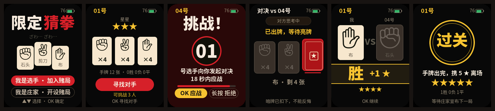
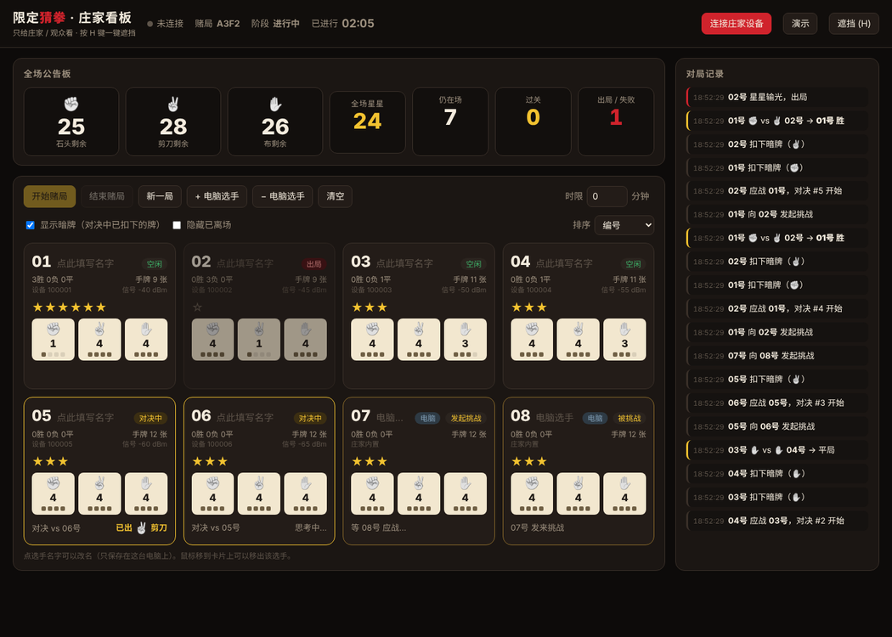

<p align="right">
  <strong>简体中文</strong> · <a href="README.md">English</a>
</p>

# 限定猜拳 —— FoloToy AI Passport

基于《赌博默示录》（开司）"限定猜拳"的多人联机派对游戏。每位选手手里一台 AI Passport，
在自己的设备上暗中出牌；另有一台 AI Passport 当**庄家**（发牌兼裁判）。庄家用 USB 接电脑，
电脑上的看板实时显示每位选手剩余的石头、剪刀、布，星星数，以及对决中双方已经扣下的暗牌——
看板只给庄家和观众看，不给选手看。

<p align="center">
  
</p>

<p align="center">
  
</p>

> 设备界面图由 `tools/render_kj_preview.py` 在电脑上用真实的界面代码和字体渲染；看板截图喂的是
> 真实固件格式的看板输出。两者都不是实机照片。

## 规则（与原作一致）

- 每人开局 **石头、剪刀、布各 4 张**，**星星 3 颗**。
- 两人约定对决：各自扣下一张牌，同时亮出。石头胜剪刀、剪刀胜布、布胜石头。胜者从败者处拿走
  **1 颗星**，平局不动；出过的牌作废。
- 星星**归零立即出局**。
- **12 张牌全部出完且星星 ≥ 3 颗即过关**；出完但不足 3 颗即**失败**。
- 庄家宣布结束（原作的时限）时，仍有手牌的人判负。

## 需要准备

| 物品 | 说明 |
| --- | --- |
| 每位选手一台 AI Passport | 人数不限；一台庄家最多 128 个座位。 |
| 再多一台 AI Passport 当庄家 | 同一份固件，持有唯一可信的赌局状态。 |
| 一台装 Chrome 或 Edge 的电脑 | 通过庄家的 USB 线显示看板（Web Serial）。可选：没有电脑也能玩。 |

只有两台设备也能玩：一台庄家 + 一位选手，在庄家上添加**电脑选手**陪练。

## 快速开始

1. 给每台设备刷入 `build/FoloToy-AI-Passport-full.bin`（见[编译与刷机](#编译与刷机)）。
2. 庄家设备在首页选择"我是庄家 · 开设赌局"。用 USB 接电脑，用 Chrome / Edge 打开
   `tools/kj_board/index.html`，点"连接庄家设备"，选择这台设备的串口。
3. 每台选手设备选择"我是选手 · 加入赌局"，在列表里选中庄家的赌局（4 位赌局号显示在庄家屏幕上），
   按 **OK** 入座。每人得到一个编号，例如 `07号`。
4. 在看板或庄家菜单里"开始赌局"。选手各自寻找对手、对决、守住星星；看板实时跟踪每一张牌。

重启后会预选上次的角色；选手设备如果还能听到上次的庄家，会自动回到原来的座位。

## 设备界面与按键

▲ / ▼ 按下即响应；OK 单击确认；长按 OK（0.5 秒）用于返回、撤回、拒绝。每个页面底部都有本页的
按键提示，右上角显示电量（读不到电量计时显示 `--`）。

| 页面 | ▲ / ▼ | OK | 长按 OK |
| --- | --- | --- | --- |
| 选择角色 | 切换选手 / 庄家 | 确定 | — |
| 寻找赌局 | 在附近的庄家之间选择（信号强的在前） | 入座 | 回到选择角色 |
| 已入座 | — | — | 离座（庄家那边保留座位） |
| 手牌主页 | — | 寻找对手 | — |
| 选择对手 | 在可挑战的人之间移动 | 发起挑战 | 回到手牌 |
| 等待应战 | — | — | 撤回挑战 |
| 收到挑战 | — | 应战 | 拒绝 |
| 出牌 | 在手里还有的牌之间移动 | 扣下这张牌（不能反悔） | 出牌前放弃这场对决 |
| 亮牌 | — | 继续 | — |
| 过关 / 出局 / 失败 | — | — | — |
| 庄家面板 | 在菜单之间移动 | 执行（结束、新一局、清空需要再按一次 OK 确认） | 取消确认 |

- **选择对手**只列出此刻空闲且在线的人。本机听得到心跳的选手按信号强弱排序，面对面的人通常排在
  第一；电脑选手和听不到的人排在后面。
- 挑战 20 秒无人应战自动作废；对决中一方消失 15 秒，对决作废，双方都不扣牌。
- 庄家屏幕只显示汇总（入座、在线、对决中、已离场），不显示任何人的手牌，可以放在明处。
- 提示音：收到挑战有警示音，对决开始、扣牌各有短音，胜 / 负 / 平 / 过关 / 出局各有不同的旋律。
  60 秒无操作屏幕变暗，第一下按键只负责点亮；有新事件时也会自动点亮。

## 电脑看板

`tools/kj_board/index.html` 是一个离线单文件：不从网上加载任何东西，也不往外发送任何数据。
在接着庄家的电脑上用 Chrome 或 Edge 打开。

- **全场公告板**：场上剩余的石头 / 剪刀 / 布总数、全场星星总数，以及仍在场、过关、出局人数。
- **每位选手一张卡片**：编号、可编辑的名字（只保存在这台电脑的浏览器里）、状态、在线与信号、
  星星、三种牌的张数与格点、战绩；对决中显示对手和已经扣下的暗牌（"显示暗牌"开关可以隐藏）。
- **操作**：开始、结束（会先确认）、新一局、增减电脑选手、清空所有座位、移出单个选手，以及可选的
  时限（分钟），到点自动结束赌局。
- **对局记录**：挑战、应战、扣牌、亮牌结果、过关、出局逐条记录。
- 按 **H** 键（或"遮挡"按钮）一键黑屏，防止选手路过时看到。
- **演示**按钮用内置模拟数据预览看板，不需要任何设备。

## 工作原理

```text
选手设备 ──ESP-NOW（信道 1）──► 庄家设备 ──USB Serial/JTAG──► 看板（Web Serial）
   ▲    请求、心跳                  │ 规则引擎、电脑选手、            "@KJ {json}" 行
   └──────── 各自的视图 ◄───────────┘ NVS 快照                        "@KJ start" 命令
```

- **一份固件，两种角色。** 庄家运行规则引擎（`main/kj_rules.c`），是唯一可信状态。选手只收到自己
  座位的视图；双方都扣牌之前，对手的牌不会发给任何人。
- **无线。** ESP-NOW（Wi-Fi STA 模式、固定信道），不需要路由器，也不需要配网。庄家每秒广播一次
  信标：赌局号、阶段、128 位"可挑战座位"位图。选手每 1.5 秒广播一次心跳：庄家据此判断在线，附近
  的选手据此按信号强弱排序。
- **可靠性在应用层**（`main/kj_server.c`、`main/kj_client.c`）：请求带序号，每 250 ms 重发直到视图
  确认；庄家去重，并重发视图直到心跳确认版本号。主机测试里有一个固定种子的仿真：25% 丢包、选手
  重启、庄家重启，都能把整局打完。
- **持久化。** 庄家在状态变化后把紧凑快照（座位、设备 ID、手牌、星星、战绩）写入 NVS。掉电重启后
  恢复赌局；进行中的对决作废，扣下的暗牌退回手中。
- **看板协议**（`main/kj_board.h`）：每行一个带 `@KJ ` 前缀的 JSON 对象，同一串口上的普通 ESP-IDF
  日志会被忽略。

## 编译与刷机

```bash
source <ESP-IDF v5.5.3 路径>/export.sh
./tools/validate.sh            # 主机测试 + 固件编译 + 合并镜像校验
```

从 `0x0` 刷入校验过的合并镜像（可能清掉已保存的数据，包括庄家保存的赌局）：

```bash
python -m esptool --chip esp32c3 -p <串口> -b 460800 write-flash 0x0 build/FoloToy-AI-Passport-full.bin
```

开发辅助：

| 命令 | 用途 |
| --- | --- |
| `python3 tools/render_kj_preview.py` | 用真实界面代码把每个设备页面渲染到 `build/kj_preview/shots/`，并报告 LVGL 内存池峰值。需要先编译一次固件得到 `managed_components/`。 |
| `python3 tools/gen_kj_fonts.py check` | 校验已提交的字体子集覆盖全部界面文字（`validate.sh` 会运行）。 |
| `python3 tools/gen_kj_fonts.py generate ...` | 修改 `main/kj_strings.h` 后重新生成字体，见 [assets](assets/README.zh_CN.md)。 |

## 限制与待验证项

- 一台庄家最多 128 个座位。无线距离、设备很多时的信道占用、与信道 1 上繁忙 2.4 GHz Wi-Fi 的共存，
  都还没有在实机上测量。
- 赌局号由庄家的 MAC 地址生成；附近有两台庄家时，靠赌局号和信号强弱区分。
- 设备上不输入名字（只有三个键）；设备上显示编号，名字由看板在本机附加。
- 选择庄家角色后，重启设备才能改选。
- 看板需要支持 Web Serial 的浏览器（电脑上的 Chrome 或 Edge）。

## 文件

| 路径 | 内容 |
| --- | --- |
| `main/kj_rules.*` | 规则引擎：座位、发牌、对决、星星、过关、超时 |
| `main/kj_proto.*` | ESP-NOW 帧格式 |
| `main/kj_server.*` / `main/kj_client.*` | 庄家与选手的协议逻辑、电脑选手 |
| `main/kj_flow.*` / `main/kj_model.*` | 界面状态机与界面模型 |
| `main/kj_ui*.c` / `main/kj_strings.h` / `main/kj_fonts.*` | LVGL 页面、全部界面文字、字体与字形自检 |
| `main/kj_board.*` | 庄家到看板的串口协议 |
| `main/kj_persist.*` / `main/kj_store.*` | 快照格式与 NVS 存储 |
| `main/kj_radio.*` / `main/kj_sound.*` / `main/main.c` | ESP-NOW 驱动胶水、合成提示音、应用任务 |
| `tools/kj_board/index.html` | 电脑看板 |
| `tests/test_kj_*.c`、`tests/test_kj_contract.py` | 主机测试，含多设备丢包仿真 |
