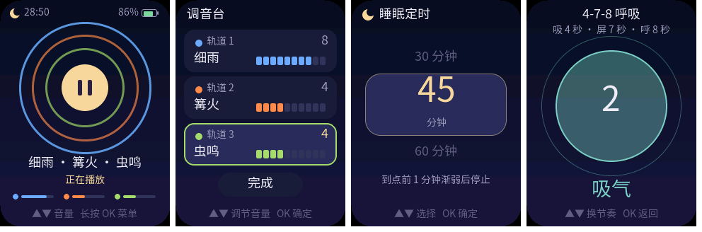

<p align="right">
  <strong>简体中文</strong> · <a href="README.md">English</a>
</p>

# ASMR 声景播放器 — FoloToy AI Passport

为 FoloToy AI Passport 打造的离线助眠 / 专注声景播放器，全中文界面，三个按键完成全部操作。
10 种声景（细雨、海浪、篝火、溪流、山风、虫鸣、颂钵与白 / 粉 / 棕噪音）全部由芯片**实时合成**：
不占存储、没有版权问题，也没有循环录音的"接缝"——每一滴雨、每一声噼啪都是随机生成的。
最多三层叠加混音，配合睡眠定时渐弱、呼吸引导和自动熄屏，适合睡前放在枕边。

<p align="center">
  
</p>

> 预览图由 `tools/render_asmr_preview.py` 在电脑上用真实界面代码与字体渲染，不是真机照片。

## 快速上手

1. 把 `build/FoloToy-AI-Passport-full.bin` 刷入设备（见[刷写固件](#刷写固件)），开机直接进入聆听页。
2. 按 **OK** 播放 / 暂停（1 秒淡入淡出），**▲ / ▼** 调主音量。
3. **长按 OK** 打开菜单：调音台（换声音、调每层音量）、睡眠定时、呼吸引导。**双击 OK** 直达呼吸引导。

首次开机默认"细雨 8 档 + 篝火 4 档"，主音量 5 档，30 分钟后渐弱停止。

## 功能

| 功能 | 说明 |
| --- | --- |
| 10 种声景 | 细雨、海浪、篝火、溪流、山风、虫鸣、颂钵、白噪音、粉噪音、棕噪音，全部实时合成、永不重复 |
| 三层混音 | 三条轨道各选一种声音、各自 0–10 档音量；换声音时 0.3 秒交叉淡化，不会"咔哒" |
| 实时试听 | 播放中在"选择声音"页上下移动，就能直接听到该声音替换进去的效果；长按取消即恢复 |
| 主音量 | 1–10 档（codec 约 −29 dB 到 0 dB，每档约 3 dB），按住 ▲▼ 连调 |
| 睡眠定时 | 不定时 / 15 / 30 / 45 / 60 / 90 分钟；最后 1 分钟按平方曲线渐弱，到点停止并显示"晚安"，随后熄屏。暂停时倒数冻结 |
| 呼吸引导 | 4-7-8 呼吸、均衡呼吸（5-5）、方块呼吸（4-4-4-4）；圆圈缓入缓出地放大缩小，中央倒数秒，声音继续播放 |
| 声景光环 | 聆听页三圈光环对应三条轨道，颜色是声音的主题色，随各层实时电平起伏 |
| 掉电保存 | 三层声音与音量、主音量、定时档位、呼吸节奏自动保存，下次开机恢复（只在静音时写 Flash，避免爆音） |
| 自动熄屏 | 播放中：20 秒调暗、45 秒熄屏，声音照常；已停止：60 秒调暗、2 分钟熄屏、10 分钟自动关机。熄屏时按任意键先亮屏，这一下不触发功能 |
| 低电量保护 | 电量 ≤ 3% 连续 3 次读数：提示"电量过低"3 秒后关机；接电脑 USB 或正在充电时不触发 |
| 离线 | 不使用 Wi-Fi 与蓝牙，固件中已关闭蓝牙 |

## 操作说明

| 页面 | ▲ / ▼ | OK 单击 | OK 双击 | OK 长按 |
| --- | --- | --- | --- | --- |
| 聆听页 | 主音量 ±1，按住连调 | 播放 / 暂停（没有可听的轨道时打开调音台） | 呼吸引导 | 打开菜单 |
| 菜单 | 上下选择（循环） | 进入：调音台 / 睡眠定时 / 呼吸引导 / 返回 | 同单击 | 返回聆听页 |
| 调音台 | 选轨道或"完成" | 选中轨道 → 选择声音；"完成" → 回聆听页 | 同单击 | 返回聆听页 |
| 调音台（调音量中） | 该层音量 ±1，按住连调 | 结束调节 | 同单击 | 结束调节 |
| 选择声音 | 在 10 种声音与"空"之间移动（播放中实时试听） | 确定，随后直接进入该层音量调节 | 同单击 | 取消，恢复原声音 |
| 睡眠定时 | 上下滚动档位 | 确定（从现在起重新倒数） | 同单击 | 取消 |
| 呼吸引导 | 切换节奏 | 返回聆听页 | 返回 | 返回 |
| "晚安"画面 | 任意键按下：回到聆听页 | | | |

呼吸引导页在进入（或切换节奏）后的 5 分钟内保持常亮；之后按正常规则调暗熄屏，免得睡着后屏幕整夜亮着。

## 声景是怎么合成的

ESP32-C3 没有浮点单元，所有合成都用 Q15 / Q30 整数定点运算，16 kHz、16 位单声道，每 15 ms 渲染一块 240 个样本。

| 声景 | 合成方法 |
| --- | --- |
| 细雨 | 去低频的粉噪声作雨幕，雨势缓慢漂移；每秒 25–75 个随机雨滴（噪声颗粒），约 1/7 是落进水洼的上滑"叮"声 |
| 海浪 | 每浪 7–13 秒随机长度：涌起时包络加速上升，拍岸后先快后慢退去；浪越高滤波越亮，浪峰叠加泡沫高频 |
| 篝火 | 低沉的火声随火苗闪烁起伏；平时每秒约 3 次噼啪，偶尔进入 40–220 ms 的爆裂簇；1/5 是闷响的"啵" |
| 溪流 | 中心频率漂移的带通流水声 + 每秒 30–60 个水泡（衰减正弦，音高随衰减上滑） |
| 山风 | 共振带通滤波的呼啸，音高与阵风强度缓慢漂移，阵风越强呼啸越高 |
| 虫鸣 | 三只远近不同的蟋蟀（4.3–5.1 kHz），每次 3–4 个脉冲，偶尔停歇；底下一层很轻的夜色底噪 |
| 颂钵 | 10–17 秒敲击一次，五声音阶随机选音；1 : 2.76 : 5.4 : 8.9 的振动模态成对失谐产生"嗡——"的拍频，各模态衰减时间不同 |
| 白 / 粉 / 棕噪音 | 白噪声；Paul Kellet 三极点粉噪声；150 Hz 一阶低通的棕噪声 |

各声景的增益按 A 计权响度校准（先去掉小喇叭放不出的 300 Hz 以下），同一层音量下听感接近。
混音器把三层（加上交叉淡化中的旧声部，最多 6 个声部）求和，再经过播放淡入淡出、定时渐弱、120 Hz 高通与软限幅。

## 代码结构

应用代码都在 `main/as_*`，硬件只通过 BSP 访问（`components/bsp` 只复用、未改动接口语义）。

| 模块 | 作用 | 依赖 |
| --- | --- | --- |
| `as_dsp` / `as_sounds` | 定点 DSP 积木与 10 种声景合成器 | 纯 C，主机可测 |
| `as_mixer` | 三层混音、交叉淡化、淡入淡出、软限幅、电平表 | 纯 C，主机可测 |
| `as_cfg` / `as_crc32` | 设置结构、带 CRC 的 16 字节存档编解码、音量与定时表 | 纯 C，主机可测 |
| `as_breath` | 呼吸节奏阶段计算、定时渐弱曲线 | 纯 C，主机可测 |
| `as_power` | 调暗 / 熄屏 / 关机计时、唤醒按键吞没、低电量判定 | 纯 C，主机可测 |
| `as_model` | 页面与按键状态机、播放与睡眠定时，输出副作用位 | 纯 C，主机可测 |
| `as_ui*` / `as_fonts` / `as_strings.h` / `as_theme.h` | LVGL 界面、字形自检、全部中文文案、配色 | LVGL，主机预览 |
| `as_audio` | 音频任务（优先级 6）：独占 codec / I2S，把混音写入 DMA，统计渲染耗时 | ESP-IDF |
| `as_store` | NVS 存档，只在音频静止时写入 | ESP-IDF |
| `as_app` | 应用任务（优先级 5）：按键队列、执行副作用、电量轮询、深睡关机流程 | ESP-IDF |

线程约定：按键回调只入队；只有应用任务修改状态机并在持有 `bsp_lvgl_lock()` 时刷新界面；
动画在 LVGL 任务的 40 ms 定时器里运行，只读界面快照与音频电平（原子字节）。

## 构建、测试与预览

```bash
source ~/esp/esp-idf-v5.5.3/export.sh
./tools/validate.sh            # 完整门禁：仓库检查 + 主机测试 + 固件构建 + 合并镜像校验
./tools/validate.sh --static   # 只跑仓库检查与主机测试
```

主机测试（`tests/test_as_*.c`、`tests/test_asmr_*.py`）覆盖：DSP 积木精度、10 种声景的电平 / 直流 / 不削波 /
可复现性、噪声颜色顺序、颂钵敲击间隔；混音器淡入淡出、斜坡上限、交叉淡化排队、三层满音量限幅、渐弱；
存档往返与任意字节损坏、越界字段；呼吸阶段与渐弱曲线；省电等级、唤醒吞键、低电量；状态机全部页面流转与睡眠定时；
字体覆盖（含负例）与 UI 字面量约束；自动关机的调用顺序与唤醒源。

开发辅助工具（不进固件）：

```bash
# 在电脑上试听：每种声景与一个三层混音各渲染一段 16 kHz WAV
cc -std=c11 -O2 -Imain tools/asmr_audio_preview.c main/as_dsp.c main/as_sounds.c main/as_mixer.c -lm -o build/asmr_audio_preview
build/asmr_audio_preview build/preview/audio 30

# 用真实 LVGL 渲染全部页面 PNG，报告字形自检与 LVGL 内存池峰值
python3 tools/render_asmr_preview.py --out build/preview

# 修改 main/as_strings.h 后重新生成字体子集（需要 Node 版 lv_font_conv 1.5.3 与思源黑体 OTF）
python3 tools/gen_asmr_fonts.py generate --lv-font-conv <lv_font_conv> --font <SourceHanSansSC-Regular.otf>
```

## 刷写固件

合并镜像 `build/FoloToy-AI-Passport-full.bin` 从 `0x0` 写入：

```bash
python -m esptool --chip esp32c3 -b 460800 write_flash 0x0 build/FoloToy-AI-Passport-full.bin
```

分区表保持仓库默认（NVS + PHY + 一个 factory 应用）。整片合并刷写可能清掉 NVS 中的旧设置，开机会回到默认值。

## 测试状态与未验证项

- 已验证（电脑上）：`./tools/validate.sh` 完整门禁通过；主机界面预览 18 个画面无缺字，LVGL 池峰值约 24 KB / 48 KB；
  离线渲染的 WAV 经频谱与响度分析，无削波。
- 真机：用户已在设备上整体实测（固件 sha256 `103fc22d…`），反馈测试通过。
- 未逐项记录的测量值：合成与混音的实际 CPU 占用（播放中每 30 秒在串口日志打印渲染耗时）、
  长时间（整夜）播放的稳定性与发热、深睡关机后各按键的开机可靠性（OK 键的唤醒余量最小）、电量计阈值。

## 许可

代码遵循仓库 [MIT License](LICENSE)。字体子集来自思源黑体（SIL Open Font License 1.1），来源与转换命令见
[`assets/fonts/as_fonts.manifest.json`](assets/fonts/as_fonts.manifest.json)。声景全部为程序合成，不含任何录音素材。
